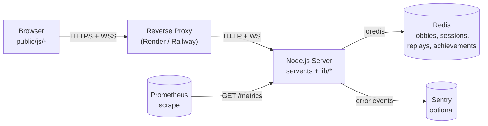
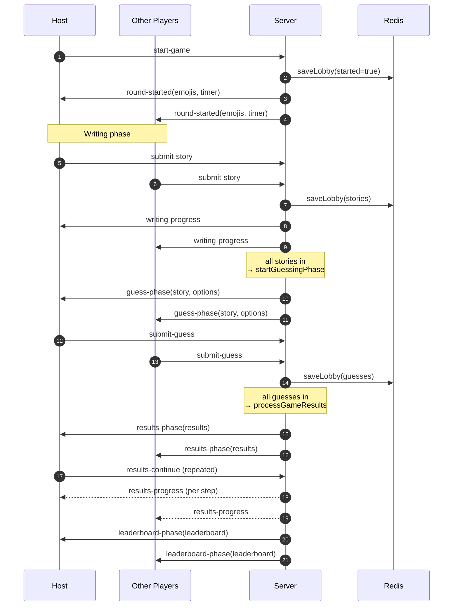
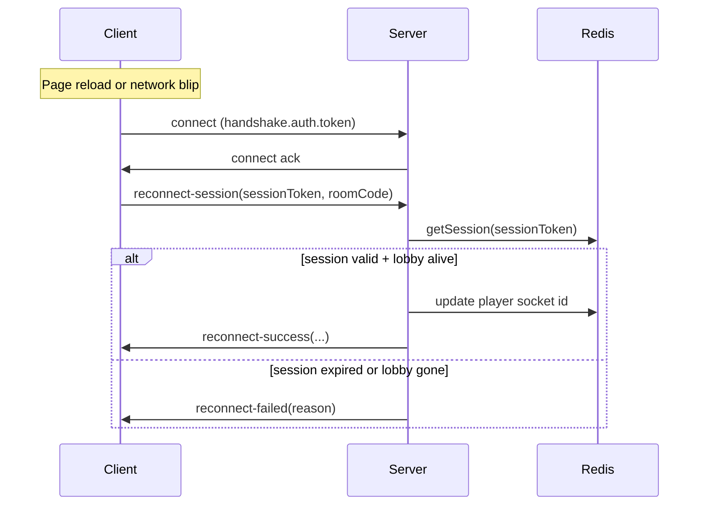

# Architecture

High-level map of how the IconTale server, client and storage layer
fit together. Start here before touching the state machine or the
Socket.io event surface.

## Big picture



## Runtime layers

| Layer | File(s) | Notes |
|---|---|---|
| HTTP + WebSocket server | `server.ts` | Express + Socket.io. Thin — offloads to `lib/*`. |
| Game flow | `lib/game-flow.ts` | Phase transitions, timers, emits. |
| Scoring | `lib/scoring.ts` | Pure functions per game mode. |
| Input validation | `lib/sanitize.ts`, `lib/wordfilter.ts` | Server-side authoritative. |
| Persistence | `lib/store.ts` | ioredis wrapper, snake_case keys. |
| Achievements | `lib/achievements.ts` | Side-effect free definitions + trigger. |
| Replays | `lib/replay.ts` | Append-only event log per game. |
| Observability | `lib/metrics.ts`, `lib/sentry.ts`, `lib/logger.ts` | All optional / self-contained. |
| Security | `lib/socket-rate-limit.ts`, `lib/socket-auth.ts` | Quotas + HMAC handshakes. |
| Emoji packs | `lib/emoji-packs.ts` | Source of truth for selectable emoji sets. |

## Client structure

```
public/
├── index.html          single-page shell, data-i18n annotated
├── styles.css          OKLCH design system + dark/light theme
├── sw.js               service worker, shell cache
├── locales/            de.json, en.json — runtime-loaded
└── js/
    ├── main.js         entry: wires DOM handlers + socket init
    ├── state.js        finite-state machine + cleanup hooks
    ├── dom.js          typed DOM reference map + utilities
    ├── ui.js           per-phase rendering
    ├── socket-handlers.js  inbound socket events
    ├── i18n.js         t() / translatePage()
    ├── theme.js        auto/light/dark cycle
    ├── focus-trap.js   modal a11y helper
    ├── radio-nav.js    arrow-key radiogroup helper
    ├── toast.js        info/success/error notifications
    ├── replay.js       replay viewer modal
    ├── sounds.js       optional WebAudio effects
    └── constants.js    emoji catalogue
```

Every `.js` file is type-checked through `tsconfig.client.json`.
See `docs/CLIENT_TYPES.md` for how the JSDoc pipeline works.

## Game flow — one round



## Reconnect



## Security layers

1. Reverse proxy terminates TLS and sets `X-Forwarded-Proto`.
2. Express trusts one proxy hop (`TRUST_PROXY=1` by default) and
   forces HTTPS in production based on `req.secure`.
3. Helmet adds strict CSP (`script-src 'self'`), `frame-ancestors
   'none'`, `base-uri 'self'`, etc. See `docs/SECURITY.md`.
4. `express-rate-limit` caps overall HTTP at 200 req / 15 min / IP.
5. Socket.io handshake carries an HMAC token minted by
   `GET /api/socket-token`; `ENFORCE_SOCKET_AUTH` toggles hard-fail.
6. Socket middleware checks per-event quotas + 32 KB payload size.
7. Every socket payload is re-validated server-side through
   `lib/sanitize.ts`.

## Observability surfaces

- `/health` — readiness + liveness JSON. 503 when Redis is
  unreachable.
- `/metrics` — Prometheus text exposition. Catalogue in
  `docs/OBSERVABILITY.md`.
- Sentry — optional, DSN-gated (`SENTRY_DSN`).
- Pino structured logs — pretty in dev, JSON lines in production.

## Where to start reading

- Adding a new game rule? Begin at `lib/scoring.ts` and follow into
  `lib/game-flow.ts`.
- Adding a new client UI element? Begin at the section in
  `public/index.html`, wire markup through `public/js/ui.js` and add
  the strings to `public/locales/*.json`.
- Touching socket events? Start from the table in
  `public/js/socket-handlers.js` and pair every new event with an
  entry in `lib/socket-rate-limit.ts` `EVENT_QUOTAS`.
